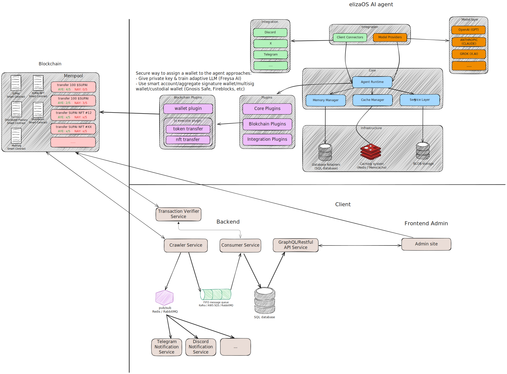

> [!IMPORTANT]
> All of these are for demonstration only, include a lot of security risk

## High level system design




## Blockchain 

- [SUPAI token smart contract](multisig-sc/contracts/token.sol)
- [SUPAI NFT smart contract](multisig-sc/contracts/nft.sol)
- [Distributor](multisig-sc/contracts/distributor.sol)
- [MultiSig Wallet](multisig-sc/contracts/multisig.sol)


## Backend

- [Crawler & GraphQL Service](crawler)
- [Telegram Notification Service](notification_service)


## How to run

1. Set up services

- Go to [crawler](crawler)

```sh
npm install
docker compose up -d
npx hardhat node
```

> After you start node by hardhat, there's a list of private keys, use 1 of them replace to `multisig-sc/clients/index.ts:14`.

2. Start service

- Start [notification_service](notification_service)

```sh
npm run start:dev
```

- Deploy smart contracts. Go to [multisig-sc](multisig-sc)

```sh
npm install
bash deploy.sh
```

then use MultiSig address in `multisig-sc/ignition/deployments/chain-31337/deployed_addresses.json:4` replace in `crawler/ponder.config.ts:32`.

- Start [crawler](crawler)

```sh
npm install
npm run dev
```

- Verify it work

Go to [multisig-sc](multisig-sc), and run:

```sh
npx ts-node multisig-sc/clients/index.ts
```

Now check the terminal 👍.